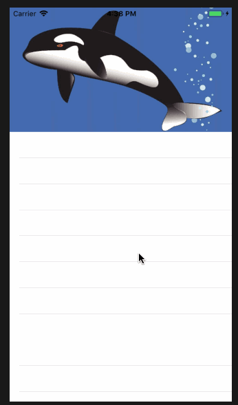

## ExpandHeader 
一键集成`UIScrolView`下拉放大的效果，这个效果在之前的个人中心页，经常出会现，现用`swift`重新实现


### 例子

```
let imageView = UIImageView(image: UIImage(named: "timg"))
imageView.frame = CGRect(x: 0, y: 0, width: 0, height: 190)
tableView.expandHeaderView = imageView
```
宽度会自动使用`scrollView`的宽度，在此主要是用到了高度。
## 协议

ExpandHeader is released under a BSD License. See LICENSE file for details.

